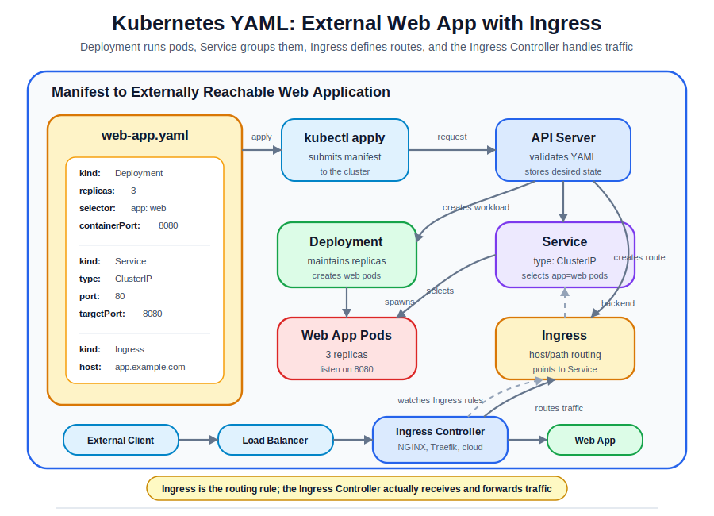

---
tags:
  - k8s/clusters
---
Exposes API endpoints used to communicate with the cluster (via [Control Plane Node](Control Plane Node.md) ). Handles RESTful API calls and ensures authentication, authorization, and admission control. 

